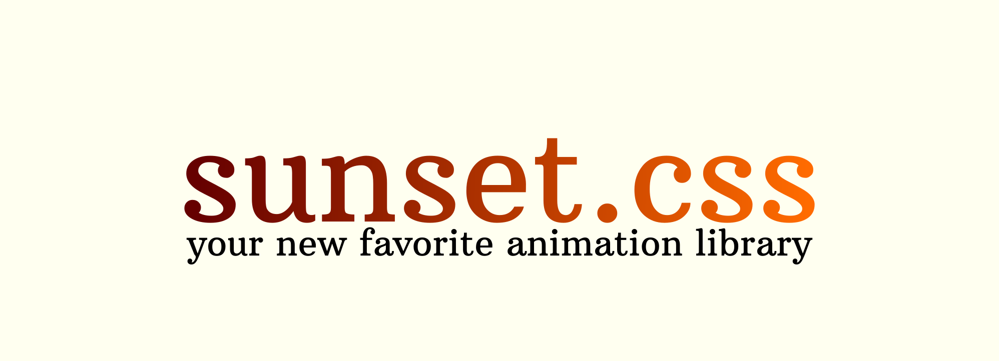

# sunset.css

This library offers a collection of different CSS-powered transitions.

[Documentation](https://github.com/philippwilhelm/sunset.css/wiki)

[Website](https://codepen.io/philippwilhelm/full/RwKZZxB)

## Download

The only file you will need is [sunset.min.css](https://github.com/philippwilhelm/sunset.css/blob/main/dist/sunset.min.css).

Download it and save it in the CSS-directory of your project.

Alternatively, you can install it via npm:

```
npm i sunset.css
```

This library is also available via [CDN](https://www.jsdelivr.com/package/npm/sunset.css).


## Usage

After downloading the source-file, you will have to include it in your .html-file:

```html
<head>
	<link rel="stylesheet" type="text/css" href="path/to/your/directory/sunset.min.css">
</head>
```

The next step is to go to  [our website](https://codepen.io/philippwilhelm/full/RwKZZxB) and find the effect you like. Click the respective field and the needed class-name will automatically be copied to your clipboard.

## Bug-report

Feel free to [open an issue](https://github.com/philippwilhelm/sunset.css/issues).

## Contributing

Please see [CONTRIBUTING.md](https://github.com/philippwilhelm/sunset.css/blob/main/CONTRIBUTING.md).

## License

This project is licensed under the [GNU Lesser General Public License v2.1](https://github.com/philippwilhelm/sunset.css/blob/main/LICENSE).

This means that you can

* use it commercially,
* modify it,
* and distribute it.

You will have to 

* add a license- and copyright notice,
* disclose the source (especially modified versions),
* state the changes you've made,
* and publish this library under the same license.

Important: Unlike the GNU General Public License, this license does NOT force you to publish your whole project under this license.
This means that you can use this library in your closed-source projects without any problems. You'll just have to publish the files of sunset.css under this license.


